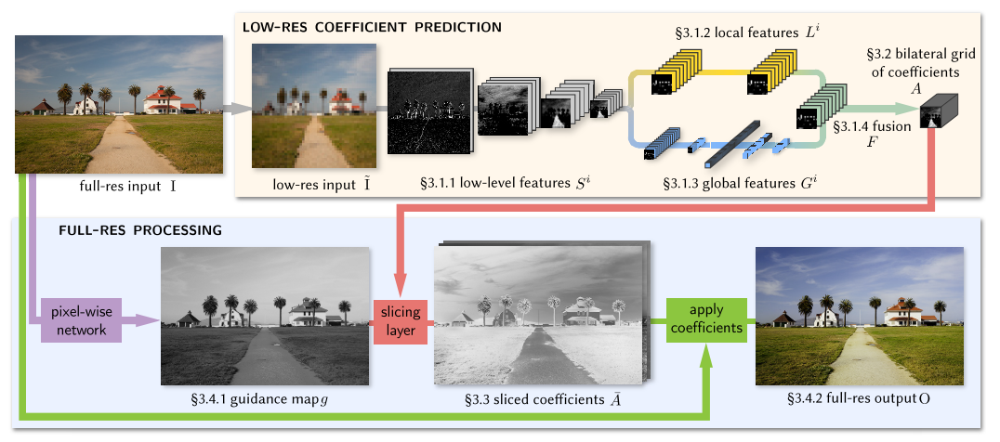

**| 论文信息**

文章：Deep Bilateral Learning for Real-Time Image Enhancement

作者：Gharbi, Michaël、Chen, Jiawen、Barron, Jonathan T.et al.

来源：ACM Transactions on Graphics

------

#### 1）创新点

- 提出了双边学习
- 应用双边学习作图像增强

#### 2）文章理解



```python
class HDRPointwiseNN(nn.Module):

    def __init__(self, params):
        super(HDRPointwiseNN, self).__init__()
        self.coeffs = Coeffs(params=params)    
        self.guide = GuideNN(params=params)
        self.slice = Slice()
        self.apply_coeffs = ApplyCoeffs()
        
    def forward(self, lowres, fullres):
        coeffs = self.coeffs(lowres) # 计算双边网格的系数
        guide = self.guide(fullres) # 计算引导图
        slice_coeffs = self.slice(coeffs, guide) # slice层
        out = self.apply_coeffs(slice_coeffs, fullres)
        return out
```

- 模型分为了四个子网
  - Coeffs，对应图中的黄色背景部分，通过低像素的输入图像，计算双边网格仿射系数
  - GuideNN，对应图中的紫色部分，通过原始输入图像，计算同样大小的引导图
  - Slice，对应图中的红色部分，Slice操作
  - ApplyCoeffs，对应图中的绿色部分，计算最后的输出图像

##### 1. Coeff子网


- Coeffs子网分为四个部分
  - 浅层特征提取模块
  - 全局特征提取模块
  - 局部特征提取模块
  - 特征融合

```python
# 计算仿射矩阵Grid
class Coeffs(nn.Module):

    def __init__(self, nin=4, nout=3, params=None):
        super(Coeffs, self).__init__()
        self.params = params
        self.nin = nin 
        self.nout = nout
        
        lb = params['luma_bins'] # 默认为8，
        cm = params['channel_multiplier'] # 默认为1，通道倍率
        sb = params['spatial_bin'] # 默认为16，local和global输入size
        bn = params['batch_norm'] # 是否使用BN层
        nsize = params['net_input_size'] # 默认为256，输入低分辨率图像size

        self.relu = nn.ReLU()

        # splat features
        # splat模块卷积层数等于输入低分辨率图像size除以希望slpat模块输出的size
        # 也就是local和global模块输入的大小
        n_layers_splat = int(np.log2(nsize/sb))
        self.splat_features = nn.ModuleList()
        prev_ch = 3
        for i in range(n_layers_splat):
            use_bn = bn if i > 0 else False
            self.splat_features.append(ConvBlock(prev_ch, cm*(2**i)*lb, 3, stride=2, batch_norm=use_bn))
            # 通道数：prev_ch -> cm*(2**i)*lb
            # cm 通道倍率 猜测是用来调整全局的模型复杂度的，默认是1
            # 2**i 基于conv层数的通道数，为2的i次方（1，2，4，8）
            # lb ？ 猜测是用于设置grid深度的，默认为8
            # 通道数：3 -> 8 -> 16 -> 32 -> 64
            prev_ch = splat_ch = cm*(2**i)*lb

        # global features
        # global模块卷积层数等于输入size除以4，log2(16/4)=2层
        n_layers_global = int(np.log2(sb/4))
        print(n_layers_global)
        self.global_features_conv = nn.ModuleList()
        self.global_features_fc = nn.ModuleList()
        for i in range(n_layers_global):
            self.global_features_conv.append(ConvBlock(prev_ch, cm*8*lb, 3, stride=2, batch_norm=bn))
            # 通道数一直不变 cm*8*lb=1*8*8=64
            prev_ch = cm*8*lb
        
        n_total = n_layers_splat + n_layers_global # 总Conv层数
        # 计算现在总像素数，用于FC层
        # prev_ch = 64*(256/2**6)**2=2**10
        prev_ch = prev_ch * (nsize/2**n_total)**2 
        self.global_features_fc.append(FC(prev_ch, 32*cm*lb, batch_norm=bn))
        self.global_features_fc.append(FC(32*cm*lb, 16*cm*lb, batch_norm=bn))
        self.global_features_fc.append(FC(16*cm*lb, 8*cm*lb, activation=None, batch_norm=bn))

        # local features
        # local模块只有两层卷积层，通道数都是64
        # 跨步为1，pad为1，所以size与输入相同
        self.local_features = nn.ModuleList()
        self.local_features.append(ConvBlock(splat_ch, 8*cm*lb, 3, batch_norm=bn))
        self.local_features.append(ConvBlock(8*cm*lb, 8*cm*lb, 3, activation=None, use_bias=False))
        
        # predicton
        # 输出通道数为8*4*3=96
        self.conv_out = ConvBlock(8*cm*lb, lb*nout*nin, 1, padding=0, activation=None)

    def forward(self, lowres_input):
        params = self.params
        bs = lowres_input.shape[0] # Batch Size
        lb = params['luma_bins']
        cm = params['channel_multiplier']
        sb = params['spatial_bin']

        # splat模块计算
        x = lowres_input
        for layer in self.splat_features:
            x = layer(x)
        splat_features = x
        
        # global模块计算
        for layer in self.global_features_conv:
            x = layer(x)
        x = x.view(bs, -1) # 拉伸后输入FC层
        for layer in self.global_features_fc:
            x = layer(x)
        global_features = x

        # local模块计算
        x = splat_features
        for layer in self.local_features:
            x = layer(x)        
        local_features = x

        # 和想象中的类似通道注意力不一样
        # 这里是直接将得到的global features([bs,64,]) reshape
        # 然后利用广播机制加到local features的每个像素上
        fusion_grid = local_features
        fusion_global = global_features.view(bs,8*cm*lb,1,1)
        fusion = self.relu(fusion_grid + fusion_global)

        x = self.conv_out(fusion)
        s = x.shape
        # torch.split 在dim=1上将输入(x)切分成(self.nin*self.nout)大小的块结构
        #             得到的是shape为[bs,xChannle/12,(size)]的一组tensor
        # torch.stack 将输入序列延dim=2进行拼接
        #             得到的是shape为[bs, 12, xChannle/12, (size)]的tensor
        # bs Batch Size
        # 12 仿射矩阵大小
        # xChannle/12 grid深度
        y = torch.stack(torch.split(x, self.nin*self.nout, 1),2)
        return y
```

##### 2. Slice子网

```python
# Slice操作层
class Slice(nn.Module):
    def __init__(self):
        super(Slice, self).__init__()

    def forward(self, bilateral_grid, guidemap): 
        # bilateral_grid Shape为[bs,12,8,16,16]
        # guidemap Shape为[bs,1,512,512]
        device = bilateral_grid.get_device()
        N, _, H, W = guidemap.shape
        # torch.meshgrid 用于生成坐标/网格，输入的两个向量的长度分别作为输出的行数和列数
        #                得到的第一个向量由第一个参数填充，第二个类似
        # torch.arange 与range函数类似，生成从[0,1,2...,H-1]的tensor
        # hg和wg Shape为[512,512]，值为从0到511
        hg, wg = torch.meshgrid([torch.arange(0, H), torch.arange(0, W)])
        if device >= 0:
            hg = hg.to(device)
            wg = wg.to(device)
        
        # tensor.repeat 对tensor进行重复扩充，得到[N,512,512]的tensor
        # tensor.unsqueeze 在dim=3上加一维，得到[N,512,512,1]的tensor
        # 然后继续归一化，将元素值范围缩放至[-1,1]
        hg = hg.float().repeat(N, 1, 1).unsqueeze(3) / (H-1) * 2 - 1 
        wg = wg.float().repeat(N, 1, 1).unsqueeze(3) / (W-1) * 2 - 1
        # tensor.permute 将tensor的维度换位，得到[N,512,512,1]的tensor
        # tensor.contiguous 改变tensor存储地址，一般在permute后使用
        guidemap = guidemap.permute(0,2,3,1).contiguous()
        # torch.cat 拼接hg,wg和guidemap然后unsqueeze，得到[N,1,512,512,3]的tensor
        # hg wg guidemap分别对应双边空间中的x y z|d
        guidemap_guide = torch.cat([hg, wg, guidemap], dim=3).unsqueeze(1)
        # F.grid_sample 第一个参数（input），第二个参数（grid）
        #               根据grid提供的坐标从input中取值，使用插值的方法得到最后的像素值
        # bilateral_grid [bs,12,8,16,16]
        # guidemap_guide [bs,1,512,512,3] 3表示(d,x,y)的坐标对，指示双边空间中的坐标
        # coeff          [bs,12,1,512,512] 使用三线性插值的方法，根据guidemap_guide中的每个(d,x,y)
        #                                  确定coeff每个像素位置的值，即bilateral_grid[:,:,d,x,y]
        coeff = F.grid_sample(bilateral_grid, guidemap_guide, 'bilinear', align_corners=True)
        
        # coeff [bs,12,512,512] 对应每个像素都有一个3x4的仿射矩阵
        return coeff.squeeze(2)
```

关键在于grid_sample的理解，其实就是使用gird提供坐标，在input中查找元素，对找到的元素坐标作插值，得到最后的输出

参考[grid_sample()函数及双线性采样](https://zhuanlan.zhihu.com/p/112030273)

##### 3. ApplyCoeffs子网

```python
class ApplyCoeffs(nn.Module):
    def __init__(self):
        super(ApplyCoeffs, self).__init__()

    def forward(self, coeff, full_res_input):
        '''
            Affine:
            r = a11*r + a12*g + a13*b + a14
            g = a21*r + a22*g + a23*b + a24
            ...
        '''
        # 使用仿射矩阵对输入图像进行计算，计算公式如上
        R = torch.sum(full_res_input * coeff[:, 0:3, :, :], dim=1, keepdim=True) + coeff[:, 3:4, :, :]
        G = torch.sum(full_res_input * coeff[:, 4:7, :, :], dim=1, keepdim=True) + coeff[:, 7:8, :, :]
        B = torch.sum(full_res_input * coeff[:, 8:11, :, :], dim=1, keepdim=True) + coeff[:, 11:12, :, :]

        return torch.cat([R, G, B], dim=1)
```

就是使用slice得到的仿射系数矩阵和原始输入计算最后的输出

#### 3）相关文章

- 双边网格提出：A Fast Approximation of the Bilateral Filter using a Signal Processing Approach
- 双边仿射提出：Bilateral Guided Upsampling
- 双边学习作去雾：Ultra-High-Definition Image Dehazing via Multi-Guided Bilateral Learning
