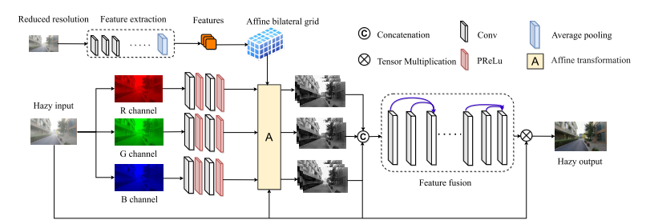
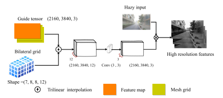

**| 论文信息**

文章：Ultra-High-Definition Image Dehazing vai Multi-Guided Bilateral Learning

作者：Zhuoran Zheng、Wenqi Ren、Xiaochun Cao et al.

来源：CVPR 2021

------

#### 1）创新点

- 使用了双边网格仿射来作Dehazing
- 对于双边网格的slice步骤，分别使用RGB三个通道的图像作引导图

#### 2）文章理解

1. 上分支（计算Affine bilateral grid）

- 双边滤波（bilateral filter），考虑像素值和权重两个因素进行滤波，可以保留边缘（注意，计算公式中是像素值差越大，权重越小，即更多的考虑和自己相似像素值的点的信息）

| [双边滤波算法](https://www.cnblogs.com/pingwen/p/12539722.html)

- 双边网格（bilateral grid），加速双边滤波的方法，分为splat（将二维图像映射到三维的双边空间），blur（正方体掠过三维的双边空间作高斯滤波），slice（有两张图像，一张通过双边网格进行处理，一张不处理，处理后的图像其实是缩小了的，因为相近像素点相近位置被放到了一个网格里面，所以需要使用不处理的图像进行插值，恢复原来的图像）

| [双边格网](https://blog.csdn.net/flow_specter/article/details/107564232)

| [双边滤波和双边网格](https://blog.csdn.net/qq26983255/article/details/108886311?spm=1001.2101.3001.6650.1&utm_medium=distribute.pc_relevant.none-task-blog-2%7Edefault%7ECTRLIST%7Edefault-1.no_search_link&depth_1-utm_source=distribute.pc_relevant.none-task-blog-2%7Edefault%7ECTRLIST%7Edefault-1.no_search_link&utm_relevant_index=2)

- 双边网格仿射，双边网格的每个格，不再填入对应的像素点，而是填入一个3x4的仿射矩阵。此时，与双边滤波的思想相同，空间上相近且像素上相近的点进行相同的仿射变换。

| [3x4的矩阵如何作仿射](https://www.aisoutu.com/a/61447)

2. 下分支（High-Quality Features Reconstruction)

- 三线性插值（trilinear interpolation），就是三维空间的线性插值

| [线性插值&双线性插值&三线性插值](https://www.cnblogs.com/yingying0907/archive/2012/11/21/2780092.html)

- 双边网格slice，使用引导图将双边网格的结果上采样（作插值）

| [slicing layer层计算](https://blog.csdn.net/CHNguoshiwushuang/article/details/81843826)

3. 末端（Feature Fusion）

就是简单的concat特征图然后输入CNN然后得到mask与原图作乘积

#### 3）讨论

- 或许可以研究下导向滤波？
- 本文分别用RGB通道的图像作slice的引导图，尝试提前对RGB图像作处理？

#### 4）相关文章

- 双边网格提出：A Fast Approximation of the Bilateral Filter using a Signal Processing Approach
- 双边仿射提出：Bilateral Guided Upsampling
- 双边网格作图像增强：Deep Bilateral Learning for Real-Time Image Enhancement

