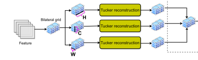

**| 论文信息**

文章：Ultra-High-Definition Image HDR Reconstruction via Collaborative Bilateral Learning

作者：Zheng, Zhuoran，Ren, Wenqi，Cao, Xiaochun et al.

来源：ICCV 2021

------

#### 1）创新点

- 使用了双边网格仿射来作HDR图像重建
- 分别使用两个分支来计算仿射双边网格
- 使用3D Tucker来增强仿射双边网格的平滑项
- 提出了LeakyAdaIN和self-evolving loss

#### 2）文章理解

- Leaky Adaptive Instance Normalization（LeakyAdaIN）

要从BN，LN和IN开始说起，这三者分别使用跨样本同通道、同样本跨通道、同样本同通道的信息进行归一化，如下图，

AdaIN是在IN的基础上，提出的一种针对风格迁移的Norm方法，有两个输入，分别是content输入x和style输入y，计算公式如下，

和其他的Norm层不同，此处的两个参数不是学习得到的，而是由风格输入y计算得到的，此时其实就是把内容输入x的均值和方差与y对齐了

而LeakyAdaIN其实就是在AdaIN的基础上，为风格输入y的方差和均值乘了个数，这个数是y的全局池化加Sigmoid函数的结果，这样直观上对y的信息考虑就增多了

因为在本文的两个分支中，上分支输入仅仅只是个灰度图，完全没有颜色信息，所有更多的考虑y的颜色信息可以改善模型性能？

- 3D Tucker

Tucker分解可以视为主成分分析（PCA）的一种高阶版本，详见[【张量分解(三)】Tucker分解](https://blog.csdn.net/bqw18744018044/article/details/105820680)

所谓3维的Tucker其实就是分别在双边网格的h，w和d三个维度作Tucker分解，将对应维度压缩为1，然后作tucker重建，将对应维度扩展为原来的大小，这样其实就提取了每个维度上的主成分，然后再求三个维度计算结果的平均

- self-evolving loss

自进化损失，没看懂。。。

#### 3）讨论

- 这个作者写了两篇使用双边网格学习的文章，分别对引导图和仿射双边网格的计算作了改进

#### 4）相关文章

- 双边网格提出：A Fast Approximation of the Bilateral Filter using a Signal Processing Approach
- 双边仿射提出：Bilateral Guided Upsampling
- 双边网格作图像增强：Deep Bilateral Learning for Real-Time Image Enhancement

